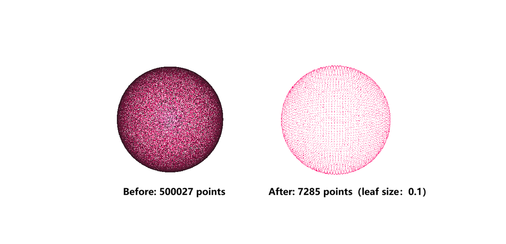

# PointCloud Processing Toolkit

A lightweight, testable C++ toolkit for point cloud I/O, filtering, spatial search, feature estimation, and rigid registration.

> **Current status:** v0.7.0 PCA-based normal estimation. The toolkit now derives local surface normals and curvature from KNN or radius neighborhoods, reports insufficient and degenerate neighborhoods explicitly, and supports deterministic or viewpoint-based orientation.

## Why This Project

Point cloud pipelines often need a small set of dependable geometric operations without the footprint of a large framework. This project implements that focused core with explicit algorithms, stable interfaces, and reproducible validation:

- point cloud data structures and PLY file I/O;
- statistics, filtering, and rigid transformations;
- spatial indexing and nearest-neighbor search;
- normal estimation and point cloud registration;
- command-line composition for repeatable processing;
- correctness tests, benchmarks, and real-data experiments.

The goal is not to replace PCL or Open3D. The project deliberately keeps a narrow scope so that each algorithm, data-flow decision, and performance result can be inspected and reproduced.

## Capabilities

| Capability                                               | Status   | Target milestone |
| -------------------------------------------------------- | -------- | ---------------- |
| Repository structure and development roadmap             | Complete | v0.0.1           |
| C++17/CMake project and core point cloud types           | Complete | v0.1.0           |
| ASCII PLY reader and writer                              | Complete | v0.2.0           |
| Point cloud statistics and rigid transformations         | Complete | v0.3.0           |
| Voxel-grid downsampling                                  | Complete | v0.4.0           |
| Brute-force KNN/radius search and radius outlier removal | Complete | v0.5.0           |
| Three-dimensional KD-tree                                | Complete | v0.6.0           |
| PCA-based normal estimation                              | Complete | v0.7.0           |
| Point-to-point ICP registration                          | Planned  | v0.8.0           |
| Unified command-line interface                           | Planned  | v0.9.0           |
| Benchmarks, CI, and real-data validation                 | Planned  | v0.10.0          |
| Documented and reproducible release                      | Planned  | v1.0.0           |

Statuses are updated only after implementation, tests, documentation, and verification are complete.

## Requirements

- CMake 3.25 or newer
- Git, required by CMake only when dependencies are first fetched
- A C++17 compiler
- Network access during the first configure step

The current Windows presets use the Visual Studio 2022 x64 generator. Eigen 3.4.1 and GoogleTest 1.17.0 are fetched automatically and pinned to release tags.

## Build and Test

Configure, build, and test the Debug preset from the repository root:

```powershell
cmake --preset windows-msvc-debug
cmake --build --preset windows-msvc-debug
ctest --preset windows-msvc-debug --output-on-failure
```

For Release:

```powershell
cmake --preset windows-msvc-release
cmake --build --preset windows-msvc-release
ctest --preset windows-msvc-release --output-on-failure
```

The first configure downloads pinned Eigen and GoogleTest sources into the ignored `build/` directory. Subsequent builds reuse the local dependency cache.

The v0.7.0 milestone has been verified with:

- Visual Studio Community 2022;
- MSVC 19.41.34120;
- Windows SDK 10.0.22621.0;
- CMake 4.3.2;
- 104 passing tests in both Debug and Release configurations.

## Command-Line Usage

The CLI exposes help, version, PLY inspection and statistics, ASCII PLY rewrite, rigid transforms, voxel-grid downsampling, and radius outlier removal:

```powershell
& '.\build\windows-msvc-debug\Debug\pointcloud_tool.exe'
& '.\build\windows-msvc-debug\Debug\pointcloud_tool.exe' --help
& '.\build\windows-msvc-debug\Debug\pointcloud_tool.exe' --version
& '.\build\windows-msvc-debug\Debug\pointcloud_tool.exe' info input.ply
& '.\build\windows-msvc-debug\Debug\pointcloud_tool.exe' stats input.ply
& '.\build\windows-msvc-debug\Debug\pointcloud_tool.exe' convert input.ply output.ply
& '.\build\windows-msvc-release\Release\pointcloud_tool.exe' voxel input.ply output.ply --leaf-size 0.5
& '.\build\windows-msvc-release\Release\pointcloud_tool.exe' radius-filter input.ply output.ply --radius 0.5 --min-neighbors 8
& '.\build\windows-msvc-debug\Debug\pointcloud_tool.exe' transform input.ply output.ply --translate 1 2 3
& '.\build\windows-msvc-debug\Debug\pointcloud_tool.exe' transform input.ply output.ply --rotate-z 90
& '.\build\windows-msvc-debug\Debug\pointcloud_tool.exe' transform input.ply output.ply --matrix 1 0 0 1 0 1 0 2 0 0 1 3 0 0 0 1
```

The library transformation API accepts angles in radians. The CLI accepts rotation angles in degrees and matrix values in row-major order. Running without arguments displays help and exits successfully. PLY, numeric, or geometry failures return exit code 1. Unknown commands, missing arguments, or extra arguments return exit code 2.

The `voxel` command reports input and output point counts, retention percentage, and algorithm processing time. The reported processing time excludes PLY input and output.

Example voxel output:

```text
input_points: 500027
output_points: 7285
retention_ratio_percent: 1.457
processing_time_ms: <machine-dependent>
wrote: output.ply
```

The `radius-filter` command applies radius outlier removal. The query point itself is excluded from its neighbor count, while a different point at the same coordinates remains a valid neighbor. The command reports the selected parameters as well as input, output, removed-point, retention, and algorithm-time metrics.

Example radius-filter output for the six-point validation fixture:

```text
input_points: 6
output_points: 5
removed_points: 1
retention_ratio_percent: 83.333
radius: 1.500
min_neighbors: 2
processing_time_ms: <machine-dependent>
wrote: output.ply
```

Radius and minimum-neighbor parameters depend on coordinate scale and sampling density. On the same fixture, `radius=0.5, min_neighbors=1` removes all six points because no distinct coordinates are close enough; `radius=100, min_neighbors=6` also removes all points because each point has only five other candidates.

Example output from `info`:

```text
points: 2
has_color: true
```

Example output from `stats` for two points at `(1, 2, 3)` and `(-1, -2, -3)`:

```text
points: 2
centroid: 0 0 0
bbox_min: -1 -2 -3
bbox_max: 1 2 3
```

## Voxel-Grid Result

The example below uses the same camera view before and after filtering. A leaf size of `0.1` reduces 500,027 points to 7,285 points, retaining approximately 1.457% of the input.



Each occupied voxel is represented by the centroid of its positions. When every input point has RGB, color channels are averaged independently and rounded to the nearest 8-bit value.

## Voxel-Grid Benchmark

The synthetic benchmark uses a fixed seed (`20260811`) and uniformly distributed coordinates in `[-100, 100]^3`. Each table entry is the median of five independent Release-process runs. Peak RSS includes the entire process, not only the voxel hash table.

Environment: Intel Core i7-9750H, 15.9 GiB RAM, Windows 10.0.26200, MSVC 19.41.34120, and CMake 4.3.2.

| Input points | Leaf size | Output points | Median time (ms) | Median peak RSS (MiB) |
| ---: | ---: | ---: | ---: | ---: |
| 10,000 | 0.5 | 9,999 | 3.713 | 5.988 |
| 100,000 | 0.5 | 99,917 | 52.194 | 22.340 |
| 1,000,000 | 0.5 | 992,150 | 822.419 | 179.840 |
| 10,000 | 5.0 | 9,280 | 4.195 | 5.848 |
| 100,000 | 5.0 | 50,631 | 28.183 | 14.312 |
| 1,000,000 | 5.0 | 64,000 | 113.447 | 29.918 |

The larger leaf size reduces the number of occupied voxels substantially at higher input scales, lowering both runtime and peak memory. The 10,000-point timing difference is small enough to be dominated by fixed overhead and normal run-to-run variation; it is not treated as a speedup claim.

Run the benchmark with:

```powershell
& '.\build\windows-msvc-release\Release\pointcloud_voxel_benchmark.exe' 1000000 0.5
```

## KD-Tree Neighbor Benchmark

The neighbor benchmark compares exact KD-tree KNN and radius queries with the
validated brute-force baseline on the same fixed synthetic clouds and query
sequences. Each result is the median of five Release repetitions after warm-up
and an exact correctness check.

Environment: Intel Core i7-9750H, 15.9 GiB RAM, Windows 10.0.26200, MSVC
19.41.34120, and CMake 4.3.2. Each scale uses 1,000 queries, `k=16`, and
`radius=5.0`.

| Points | Max depth | Build (ms) | Brute KNN (ms) | KD KNN (ms) | KNN speedup | Brute radius (ms) | KD radius (ms) | Radius speedup |
| ---: | ---: | ---: | ---: | ---: | ---: | ---: | ---: | ---: |
| 10,000 | 14 | 3.100 | 76.345 | 4.953 | 15.414× | 68.232 | 0.624 | 109.434× |
| 100,000 | 17 | 41.086 | 1,108.530 | 5.915 | 187.397× | 1,064.478 | 2.505 | 424.924× |
| 1,000,000 | 20 | 611.915 | 9,984.119 | 10.296 | 969.727× | 9,540.028 | 18.377 | 519.143× |

The speedups describe the complete public APIs. Brute-force queries include
per-query cloud validation and candidate allocation, whereas KD-tree cloud
validation is paid once during construction. Construction time is reported
separately and must be considered for workloads with few queries. Full
methodology, commands, interpretation, and limitations are in
[`docs/benchmark.md`](docs/benchmark.md).

## PCA Normal-Estimation Experiment

The normal estimator builds one KD-tree per public estimation call, includes
the query point in its neighborhood, accumulates centroids and covariance
matrices in double precision, and uses Eigen's self-adjoint eigensolver. The
smallest-eigenvalue eigenvector is the normal, while
`lambda0 / (lambda0 + lambda1 + lambda2)` is reported as a local surface
variation measure.

The fixed-seed experiment uses a `100 x 100` regular XY grid in `[-1, 1]^2`,
adds Gaussian noise only along Z, and estimates every normal with `k=20`.
Angular error is sign-invariant relative to the ideal positive-Z normal. Each
time is the median of five Release repetitions after warm-up and includes
KD-tree construction plus the complete estimation pass.

Environment: Intel Core i7-9750H, 15.9 GiB RAM, Windows 10.0.26200, MSVC
19.41.34120, and CMake 4.3.2.

| Z-noise sigma | Total median (ms) | Valid normals | Mean error (deg) | Median error (deg) | P95 error (deg) | Mean curvature |
| ---: | ---: | ---: | ---: | ---: | ---: | ---: |
| 0.000 | 94.9764 | 10,000 | 0.000000 | 0.000000 | 0.000000 | 0.000000 |
| 0.001 | 88.4596 | 10,000 | 0.576767 | 0.539230 | 1.141582 | 0.000608 |
| 0.005 | 81.8396 | 10,000 | 3.017098 | 2.814595 | 5.948408 | 0.014920 |
| 0.010 | 87.3256 | 10,000 | 6.346142 | 5.950517 | 12.360669 | 0.052496 |

All 10,000 neighborhoods remained valid. Angular error and curvature rose with
noise, while runtime differences were treated as normal measurement variation
rather than a noise-dependent performance trend.

Run the experiment with:

```powershell
& '.\build\windows-msvc-release\Release\pointcloud_normal_benchmark.exe' 100 20 5
```

## Current Structure

```text
PointCloud_Processing_Toolkit/
├── app/
│   └── main.cpp
├── benchmarks/
│   ├── benchmark_neighbor_search.cpp
│   ├── benchmark_normal_estimation.cpp
│   └── benchmark_voxel_grid.cpp
├── docs/
│   ├── benchmark.md
│   └── images/
│       └── voxel_before_after.png
├── include/pct/
│   ├── core/
│   │   ├── point.hpp
│   │   └── point_cloud.hpp
│   ├── features/
│   │   └── normal_estimation.hpp
│   ├── filters/
│   │   ├── radius_outlier.hpp
│   │   └── voxel_grid.hpp
│   ├── geometry/
│   │   ├── statistics.hpp
│   │   └── transform.hpp
│   ├── io/
│   │   └── ply_io.hpp
│   └── search/
│       ├── brute_force.hpp
│       ├── kd_tree.hpp
│       └── neighbor.hpp
├── src/
│   ├── core/
│   │   └── point_cloud.cpp
│   ├── features/
│   │   └── normal_estimation.cpp
│   ├── filters/
│   │   ├── radius_outlier.cpp
│   │   └── voxel_grid.cpp
│   ├── geometry/
│   │   ├── statistics.cpp
│   │   └── transform.cpp
│   ├── io/
│   │   └── ply_io.cpp
│   └── search/
│       ├── brute_force.cpp
│       └── kd_tree.cpp
├── tests/
│   ├── fixtures/
│   │   ├── ascii_xyz.ply
│   │   ├── ascii_xyz_rgb.ply
│   │   ├── ascii_reordered_unknown.ply
│   │   ├── voxel_input_xyz_rgb.ply
│   │   ├── radius_filter_input_xyz_rgb.ply
│   │   └── malformed_*.ply
│   ├── unit/
│   │   ├── test_point_cloud.cpp
│   │   ├── test_ply_io.cpp
│   │   ├── test_statistics.cpp
│   │   ├── test_transform.cpp
│   │   ├── test_voxel_grid.cpp
│   │   ├── test_brute_force.cpp
│   │   ├── test_radius_outlier.cpp
│   │   ├── test_kd_tree.cpp
│   │   └── test_normal_estimation.cpp
│   └── CMakeLists.txt
├── CMakeLists.txt
├── CMakePresets.json
└── README.md
```

Directories are introduced only when their first real implementation is added. Empty architecture placeholders are intentionally not committed.

## Core API

The `pct::Point` type currently stores:

- a three-dimensional `Eigen::Vector3f` position;
- an optional 8-bit RGB color.

The `pct::PointCloud` type owns an aligned point container and provides:

- `empty()` and `size()`;
- checked access through `at()`;
- unchecked access through `operator[]`;
- copy and move insertion through `pushBack()`;
- `clear()` and direct container access.

File I/O and processing algorithms are intentionally kept outside `PointCloud` so that storage, serialization, and algorithms remain separate responsibilities.

The `pct::io` API currently provides:

- `readPly()` for validated ASCII PLY 1.0 input;
- `writePlyAscii()` for XYZ or XYZRGB output;
- `PlyError` for file access, format, schema, and numeric validation failures.

The `pct::geometry` API currently provides:

- single-pass point count, centroid, and axis-aligned bounding-box statistics;
- explicit undefined centroid and bounding-box results for empty point clouds;
- rigid-transform construction from translation and X/Y/Z axis rotations;
- validation of finite homogeneous matrices, rotation orthogonality, and determinant;
- point-cloud transformation with optional RGB attributes preserved.

The `pct::filters` API currently provides:

- `voxelGridDownsample()` with a finite, positive leaf size;
- signed 64-bit voxel indices computed with `floor(position / leaf_size)`;
- double-precision position accumulation and centroid output;
- RGB mean aggregation for fully colored clouds and preservation of uncolored clouds;
- rejection of partially colored clouds, non-finite coordinates, and voxel-index overflow;
- lexicographically ordered voxel output for deterministic results;
- radius outlier removal with a finite, non-negative radius and a positive minimum-neighbor count;
- explicit exclusion of the query point's index while retaining coincident points at other indices;
- preservation of input order, positions, and optional RGB attributes for retained points.

The `pct::search` API currently provides:

- brute-force KNN and radius queries that scan every input point;
- neighbor results containing the original point index and a double-precision squared distance;
- optional exclusion of one point index, without discarding other coincident points;
- inclusive radius boundaries and deterministic ordering by distance and then index;
- explicit rejection of non-finite queries, non-finite point positions, invalid radii, and out-of-range excluded indices.
- a median-balanced three-dimensional `KdTree` with cyclic X/Y/Z splitting;
- exact KNN and radius queries using recursive near/far traversal and plane-distance pruning;
- the same squared-distance, index-exclusion, boundary, tie-breaking, and result-ordering semantics as brute force;
- node-count, maximum-depth, and construction-time statistics;
- a static non-owning index whose source cloud must outlive the tree and remain unchanged.

The `pct::features` API currently provides:

- KNN- and radius-based PCA normal estimation backed by one KD-tree per call;
- double-precision centroid, covariance, eigendecomposition, and curvature calculations;
- normals from the smallest-eigenvalue eigenvector and curvature from the normalized smallest eigenvalue;
- an actual neighbor count and explicit `Valid`, `InsufficientNeighbors`, or `DegenerateNeighborhood` status for every input point;
- rank-aware rejection of collinear and coincident neighborhoods without NaN output;
- deterministic dominant-component orientation when no viewpoint is supplied;
- optional orientation toward a finite viewpoint;
- inclusion of the query point itself in both KNN and radius neighborhoods.

## Validation

The v0.7.0 test suite covers:

- CLI startup without arguments;
- CLI help and version commands;
- default point state;
- optional RGB color storage;
- empty point clouds;
- copy/move insertion and access;
- checked out-of-range access;
- point cloud clearing.
- ASCII XYZ and XYZRGB input;
- reordered and unknown scalar vertex properties;
- XYZ and XYZRGB read/write/read round trips;
- missing files, binary format, missing coordinates, and point-count mismatches;
- non-finite coordinates and incomplete RGB schemas;
- partially colored point clouds and prevention of partial output files;
- the CLI `info` command against a real fixture.
- empty, single-point, and analytical multi-point statistics;
- centroid and axis-aligned bounding-box results;
- identity, translation, and X/Y/Z axis rotations;
- transform composition order and inverse recovery;
- preservation of optional RGB attributes during transformation;
- rejection of non-finite coordinates, non-finite matrices, scaling, and invalid homogeneous rows;
- the CLI `stats` and `transform` commands with translation, rotation, and row-major matrix input.
- empty-cloud and analytical voxel-centroid behavior;
- positive, negative, and exact voxel-boundary coordinates;
- RGB aggregation, uncolored input, and rejection of partially colored input;
- invalid leaf sizes, non-finite positions, and signed 64-bit voxel-index overflow;
- deterministic voxel ordering and shuffled-input equivalence;
- the CLI `voxel` command and its invalid-leaf failure path;
- Release benchmark runs at 10,000, 100,000, and 1,000,000 synthetic points with two leaf sizes.
- analytical KNN and radius queries on a line and a regular grid;
- deterministic distance ordering and index tie-breaking;
- empty clouds, zero `k`, `k` greater than the cloud size, inclusive radius boundaries, and maximum finite radii;
- coincident points at distinct indices and explicit query-index exclusion;
- KNN results compared item by item with an independent full-sort baseline;
- radius outlier removal on a colored cluster with one isolated point;
- invalid radius and neighbor-count paths, parameter sensitivity, and complete-removal cases;
- the `radius-filter` CLI success and invalid-parameter paths.
- KD-tree construction for empty, single-point, sorted, duplicate, collinear, and coplanar clouds;
- 300 randomized KNN and radius query pairs compared item by item with brute force;
- balanced node-count and maximum-depth statistics;
- zero K, K above the available point count, inclusive radius boundaries, and excluded-index behavior;
- a regression case in which an excluded node is visited before the candidate heap is populated;
- rejection of non-finite construction data, non-finite queries, negative radii, and out-of-range indices;
- Release neighbor-search benchmarks at 10,000, 100,000, and 1,000,000 points.
- exact planar normals and near-zero planar curvature with KNN and radius neighborhoods;
- viewpoint-controlled normal orientation above and below a plane;
- explicit finite results for insufficient, collinear, and coincident neighborhoods;
- sign-invariant radial normal checks on a synthetic sphere;
- finite unit normals and bounded mean angular error on a fixed noisy plane;
- invalid K, radius, minimum-neighbor, viewpoint, and point-position inputs;
- a fixed-seed 10,000-point Release experiment reporting mean, median, and P95 angular errors, validity, curvature, and total runtime across four noise levels.

Future algorithms will use four levels of validation:

1. **Analytical unit tests:** tiny point clouds with hand-computed expected results.
2. **Baseline comparison:** optimized methods compared with simple correctness baselines.
3. **Synthetic experiments:** known transforms, controlled noise, outliers, density, and overlap.
4. **Real-data experiments:** licensed public point clouds processed with documented commands and parameters.

All benchmark claims will identify the build type, compiler, hardware, input scale, query count, and aggregation method.

## PLY Support and Limitations

The v0.2.0 milestone intentionally supports a narrow, explicit PLY subset:

- ASCII PLY format 1.0;
- required `x`, `y`, and `z` vertex properties;
- optional `red`, `green`, and `blue` properties;
- arbitrary ordering of supported vertex properties;
- ignored unknown scalar vertex properties;
- comments and `obj_info` header entries.

Current limitations:

- binary little-endian and big-endian PLY are rejected;
- face, edge, and other non-vertex data are not loaded or preserved;
- vertex list properties are not supported;
- unknown vertex attributes are not preserved when rewriting a file;
- coordinates are stored as single-precision floats;
- all points must either have RGB color or have no color when writing;
- this milestone does not target optimized loading of very large ASCII files.
- geometry coordinates and transformation matrices use single-precision floats;
- transformations are restricted to finite rigid matrices; scaling, shear, reflection, and projective transforms are rejected;
- axis-aligned bounding boxes depend on the current coordinate frame and must be recomputed after rotation;
- the geometry functions process point clouds in memory and do not yet provide parallel or streaming execution.
- voxel hashing has expected linear aggregation time but can degrade under severe hash collisions;
- deterministic voxel ordering adds `O(V log V)` work after aggregation, where `V` is the number of occupied voxels;
- the voxel grid is anchored at the coordinate origin and does not expose a configurable grid origin;
- voxel processing is currently single-threaded and in memory;
- only positions and optional RGB are aggregated, and unknown PLY attributes are not preserved;
- benchmark peak RSS measures the complete process rather than filter-exclusive allocation.
- brute-force neighborhood queries scan every point and are intended as a correctness baseline rather than a high-performance spatial index;
- ordered KNN and radius results add sorting work after distance evaluation;
- repeated brute-force radius queries make the current radius outlier filter unsuitable for large point clouds;
- radius-filter parameters depend on coordinate scale and sampling density and can remove valid sparse structures when poorly chosen.
- KD-tree queries can degrade to linear time when pruning is ineffective or result sets are large;
- the KD-tree is static and non-owning, so the source cloud must outlive it and must not change point coordinates or ordering;
- cyclic splitting is simple and deterministic but does not adapt the axis to local variance;
- the published neighbor benchmark uses one synthetic uniform distribution and does not represent every real point-cloud geometry;
- benchmark speedups compare the complete validated public APIs rather than validation-free search kernels.
- normal estimates depend on neighborhood size, point density, noise, boundaries, and whether a neighborhood crosses multiple surfaces;
- local PCA determines a normal axis but not a globally consistent surface orientation;
- one optional viewpoint can orient normals toward that viewpoint, but no graph-based orientation propagation is implemented;
- rank thresholds reject line-like and coincident neighborhoods, while nearly degenerate real data may remain threshold-sensitive;
- each public normal-estimation call constructs a new KD-tree and currently runs in memory on one CPU thread;
- normal and curvature values are returned separately and are not yet written as PLY vertex properties.

## Design Principles

1. Keep the scope small enough to finish and understand.
2. Implement important algorithms rather than wrapping existing point cloud APIs.
3. Separate point cloud storage, I/O, algorithms, and the CLI.
4. Add deterministic tests before calling a feature complete.
5. Compare optimized implementations with simple correctness baselines.
6. Record hardware, compiler settings, dataset characteristics, and methodology for performance claims.
7. Document failure cases and limitations, not only successful examples.
8. Keep the default branch buildable and testable.

## Non-Goals

- Replacing PCL or Open3D
- Building a full SfM, MVS, SLAM, or neural-rendering system
- Creating a GUI
- Supporting many file formats before the core algorithms are validated
- Claiming high performance without reproducible benchmarks
- Accumulating a large number of shallow filters

## Documentation

Source code, public APIs, commit messages, and repository documentation use English. Algorithm notes will state assumptions, numerical tolerances, known failure cases, and validation methodology.

## License

This project is licensed under the [MIT License](LICENSE).
